[中文](README.md) | [English](README.en.md)

# ConfigPair · 知华参数组合测试与覆盖复核系统


**知华科技（上海如静知华信息科技有限公司）** · [官网](https://www.zhuatech.cn/) · 商业授权、定制开发、部署与系统集成咨询微信 **zhuatech / zhuatech2**。

**公开源码学习版／非商业源码版 · 0.1.0**。自有源码适用 [ZhuaTech Non-Commercial Source License 1.0](LICENSE)，未经书面授权不得商用。公开可读源码不等于 OSI 开源许可；第三方版权及许可独立保留。

## 项目简介与适用场景：从配置空间到测试事实

浏览器、认证方式、界面语言和终端等离散参数相互组合，会迅速增加兼容性用例。ConfigPair面向测试设计、研发验证和质量复核的学习与非商业流程研究：显式维护候选值和禁配规则，生成覆盖全部可达值对的确定性用例，再由指定人员登记人工结果、独立复核并封存。

生成计划、实际执行、实际通过分别统计。计划覆盖100%不表示已经执行，也不表示不存在缺陷；失败用例计入执行覆盖，阻塞与未登记不计入。页面和报告都保存这一差别。

[操作手册](docs/操作手册.md) · [接口说明](docs/接口说明.md) · [架构与数据](docs/架构与数据.md) · [部署与恢复](docs/部署与恢复.md)

### 一次测试计划的流程

```text
明确对象、版本、环境和准则 → 定义离散参数与二元禁配 → 生成完整覆盖计划
         ↑                                             ↓
      输入修订 ← 独立复核退回 ← 送审 ← 当前输入与计划摘要校验
                                                       ↓
                        独立批准并冻结 → 开启登记 → 指定执行人收悉
                                                       ↓
                      逐例通过／失败／阻塞 → 提交完成／部分阻塞报告
                                                       ↓
                             独立复核／退回修订 → 按实际结果封存
```

“开启登记”只开启软件记录流程；系统不会运行被测程序、打开证据链接或调用外部测试工具。编辑人、执行人与复核人相互独立；曾经编辑过该计划的人换角色后仍不能独立复核。

## 功能地图

| 领域 | 已实现 |
|---|---|
| 测试对象 | 唯一编号、负责部门、系统类型、对象名称、版本、环境、预期行为与判定准则、指定复核／执行岗位 |
| 参数设计 | 2—8个参数，每个2—8个明确候选值；编码、候选值去重和有限输入；增删改与引用保护 |
| 禁配管理 | 最多80条不同参数之间的二元禁配；正反重复检测、明确原因、非法引用拒绝 |
| 组合生成 | 完整枚举合法配置，由合法配置计算可达值对，再以确定性贪心生成覆盖全部可达值对的用例 |
| 覆盖矩阵 | 参数轴可切换，区分生成计划／实际执行／实际通过、未覆盖及禁配不可达；单列不可达候选值 |
| 版本与复核 | 不可变输入与计划JSON、算法版本、SHA-256；修改输入使当前计划失效，历史快照仍保留；独立批准冻结 |
| 人工测试 | 指定执行人收悉；逐例显式通过／失败／阻塞，失败与阻塞必须说明；文本证据参考；修订保留旧事实历史 |
| 结果封存 | 全部用例登记后报告送审；完成／部分阻塞申报校验；独立封存为全部通过、有缺陷或部分阻塞 |
| 查询与导出 | 范围内搜索、状态筛选、排序、分页；JSON报告、带UTF-8 BOM的用例CSV及公式注入防护 |
| 工作空间管理 | 会话登录、退出、改密；账号、角色、部门、导航、权限、系统类型、参数和操作审计 |
| 页面 | 中文／英文、电脑／手机布局、真实空状态、明确错误反馈、正式知华LOGO与咨询入口 |

本版未实现三元及更高强度覆盖、任意布尔约束、连续参数区间、最少用例精确求解、测试脚本生成／执行、CI发布阻断、缺陷工单、第三方设备／账号集成、多租户、高可用或外部不可篡改签名。没有预置业务案例、假执行结果或第三方服务演示模式；核心业务真实持久化。无需AI或外部测试服务配置，对外HTTPS和备份存储由部署方配置。

## 覆盖算法的具体口径

1. **输入上限在禁配前计算。** 原始配置数为各参数候选值数的乘积，最多20000；即使禁配能大幅减少配置，也不能绕过这个上限。
2. **完整枚举合法配置。** 应用所有二元禁配，零合法配置明确报错；不抽样、不截断、不静默丢弃配置。
3. **仅合法配置中的值对进入分母。** 某个候选值可能完全不可达；相应值对排除并展示不可达状态，而非计算为漏测。
4. **自主确定性贪心。** 算法`FEASIBLE-PAIR-GREEDY-1`每轮选择新增覆盖值对最多的合法配置，平局采用稳定枚举次序；最多256条用例，超限明确报错，保证输出计划完整覆盖但不保证用例数最少。
5. **实际覆盖来自人工状态。** PASS／FAIL计入执行值对，PASS计入通过值对；BLOCKED与PENDING均不计入。一个值对可能被多条用例覆盖，按集合去重。
6. **报告结局由完整事实推导。** 无阻塞且全部通过为`PASSED`；无阻塞但有失败为`ISSUES`；有阻塞为`PARTIAL`。未登记不能提交，不能用完成申报掩盖阻塞。

[NIST组合测试指南](https://csrc.nist.gov/pubs/sp/800/142/final)与[NIST覆盖测量说明](https://www.nist.gov/publications/combinatorial-coverage-measurement)提供组合覆盖概念背景。本版自主实现有界二元模型，没有集成或复制ACTS；成对覆盖无法保证发现涉及三个或更多参数的缺陷，实际测试仍需领域准则和风险判断。

每张计划最多50次生成；计划总数由`maxRecords`设置在100—1000之间；成功请求键最多10000。历史输入、冻结摘要和实际结果可追溯，但摘要不能防止有权限的数据库管理员同时修改数据与摘要。

## 岗位、范围和实时授权

| 初始岗位 | 使用入口和限制 |
|---|---|
| 管理员 | ALL目录与身份管理；业务仍受指定岗位、状态和独立性约束 |
| 方案设计 | 本部门计划、参数、禁配、生成、送审、开启登记、取消与导出 |
| 独立复核 | 本部门查阅；仅复核本人被指定且未编辑／执行的计划与报告 |
| 测试执行 | SELF范围，只操作本人被指定的同部门计划；收悉、登记、报告提交 |
| 部门查阅 | 本部门只读、统计和导出，无业务写入 |

纯执行岗位即使配置ALL范围，也只访问本人被指定计划。SELF关系包含创建、历史编辑或明确指定，并继续受部门限制。当前账号、启用状态、角色、范围与权限在每次请求检查；撤权及停用不能由缓存成功响应绕过。业务写入在事务锁内校验整计划版本与UUID请求键，同键同请求重放结果，同键异请求拒绝；并发旧版本只能一方成功。

### 运行页面

以下为当前真实运行系统中的隔离`TEST`验收记录，正式首次启动的业务库为空。

| 模型与业务 | 工作空间与管理 |
|---|---|
| 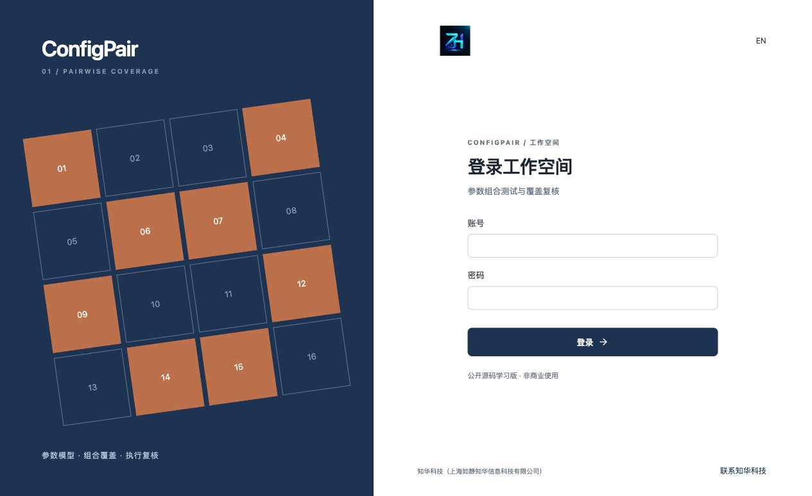<br>**登录**：通过会话认证进入工作空间。 | 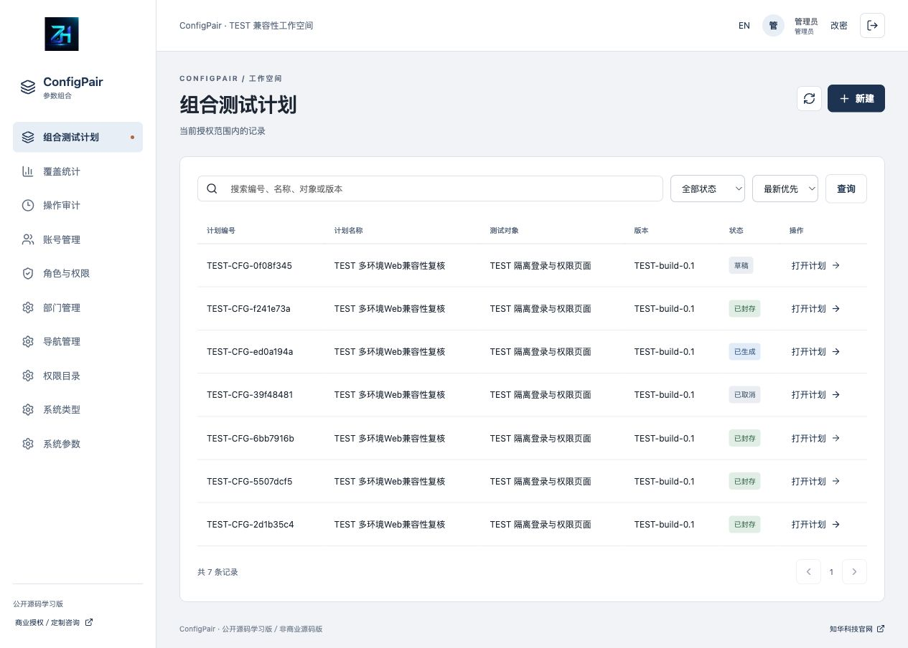<br>**计划列表**：查询、筛选并进入权限范围内的测试计划。 |
| 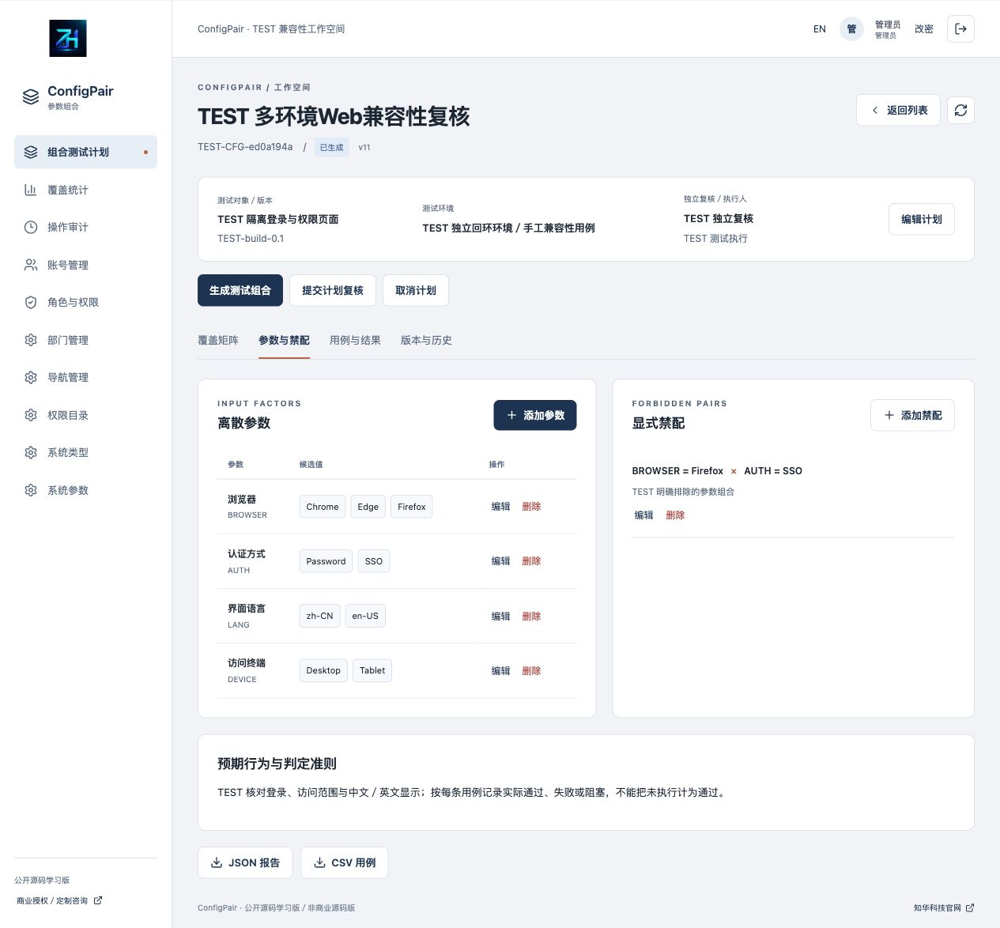<br>**参数与禁配**：维护离散候选值和二元禁配规则。 | 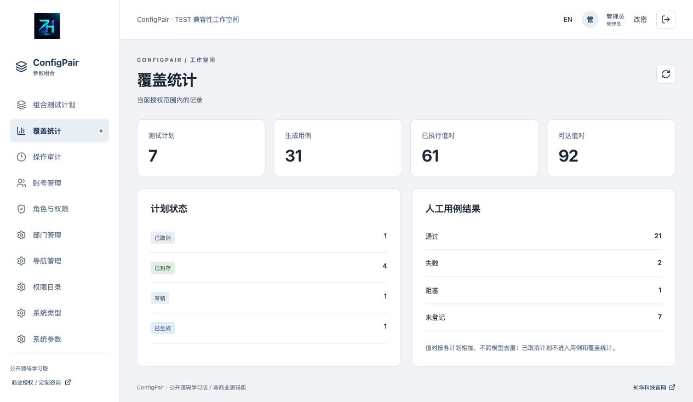<br>**覆盖统计**：分别查看计划、执行和通过覆盖。 |
| 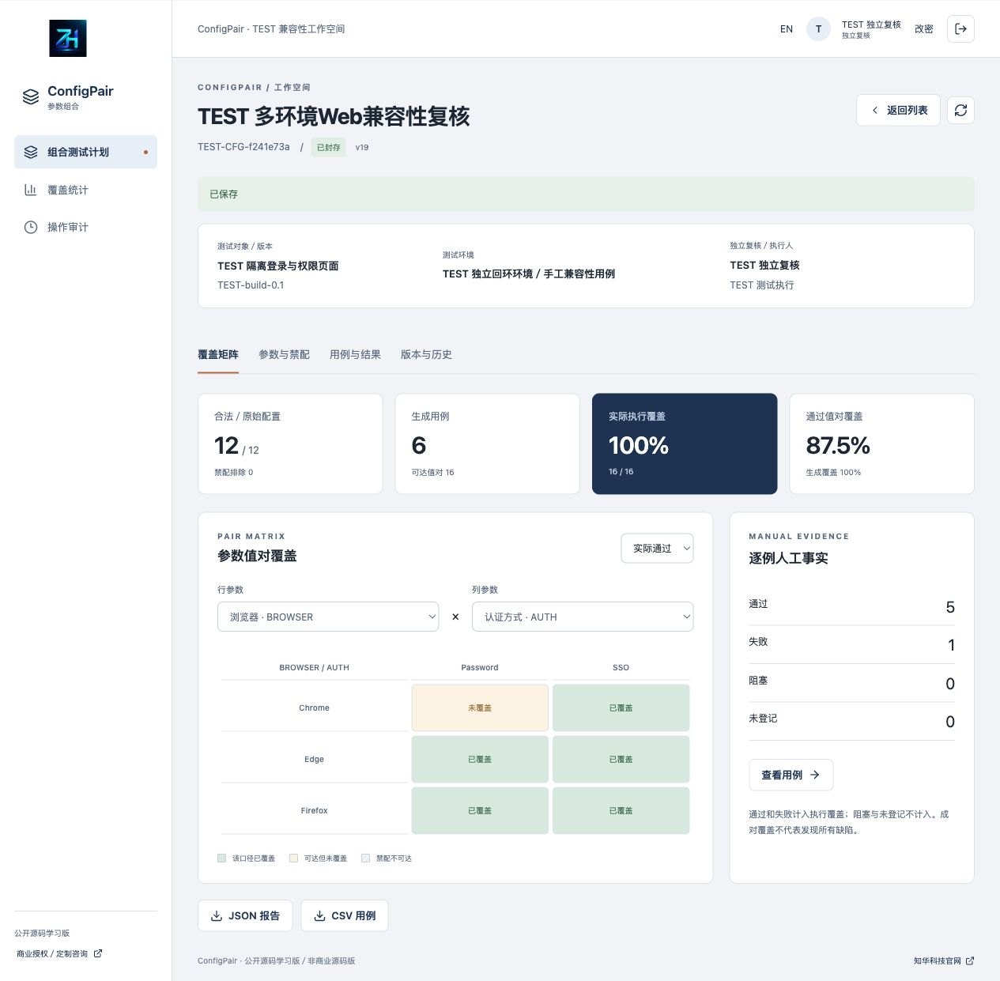<br>**覆盖矩阵**：切换参数轴和覆盖口径，区分不可达值对。 | 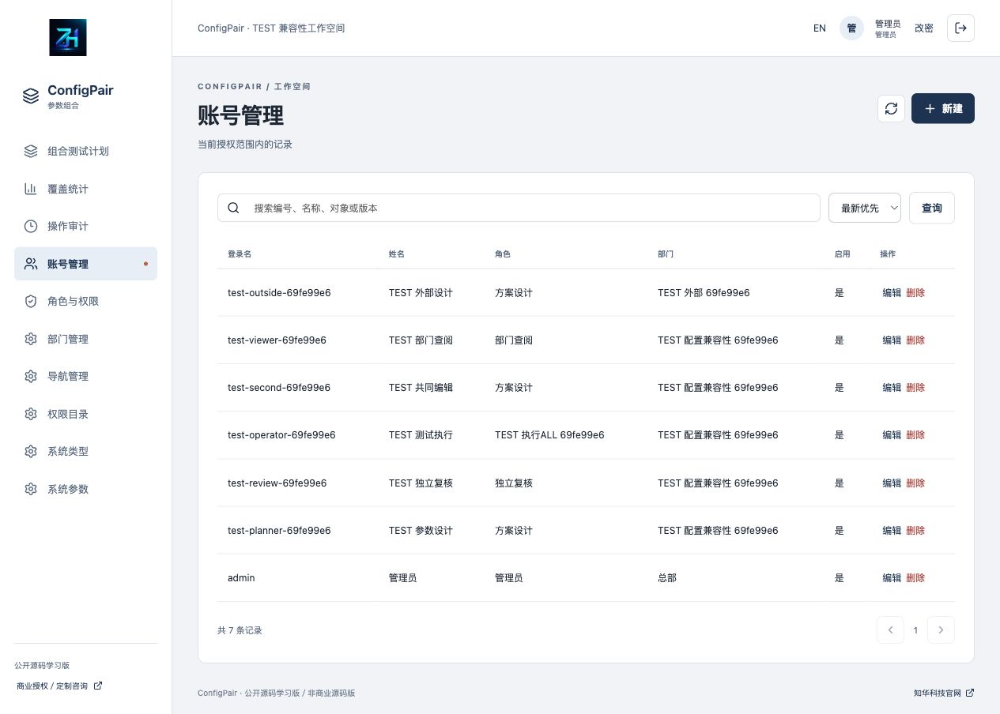<br>**账号管理**：维护部门、岗位及账号启用状态。 |
| 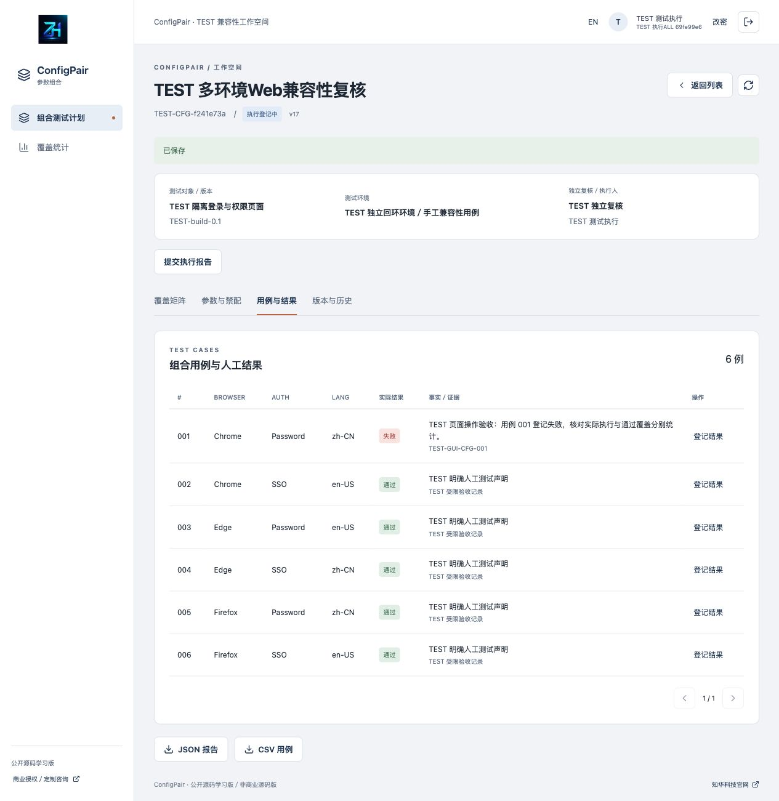<br>**实际结果**：由指定执行人逐例登记通过、失败或阻塞。 | 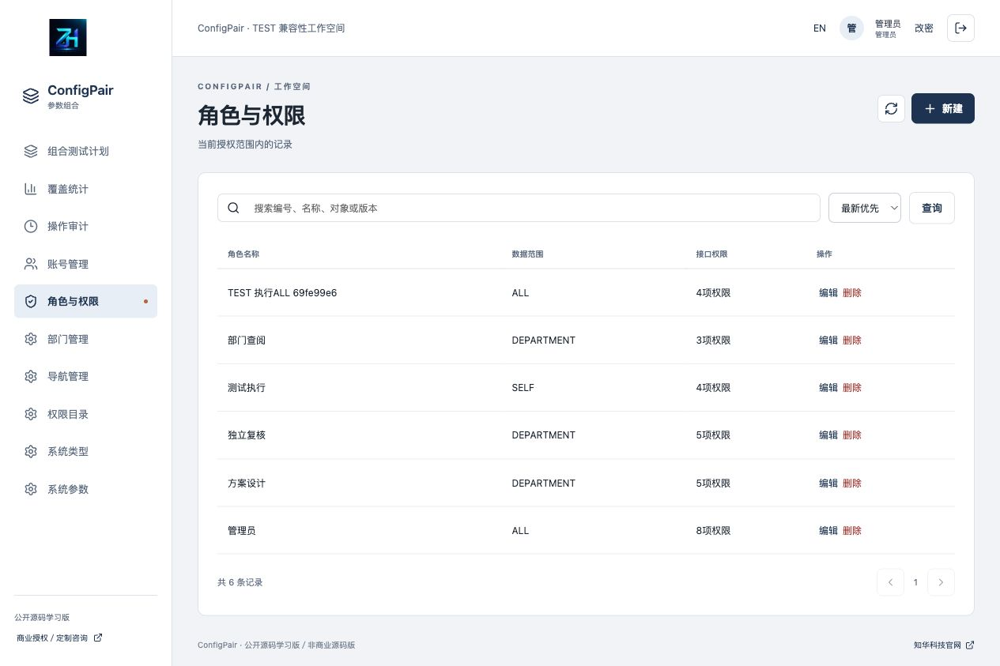<br>**角色权限**：配置接口权限及数据范围。 |
| 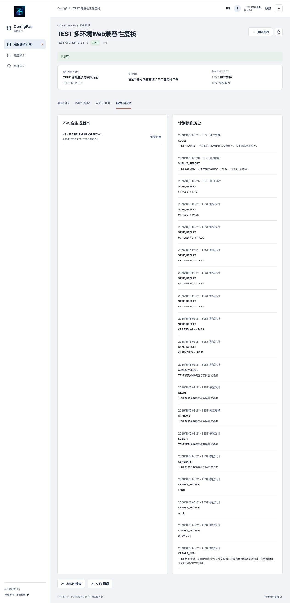<br>**版本历史**：查看生成快照和结果修订事实。 | 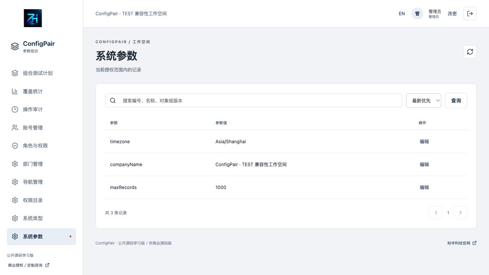<br>**系统参数**：维护允许调整的工作空间设置。 |
| 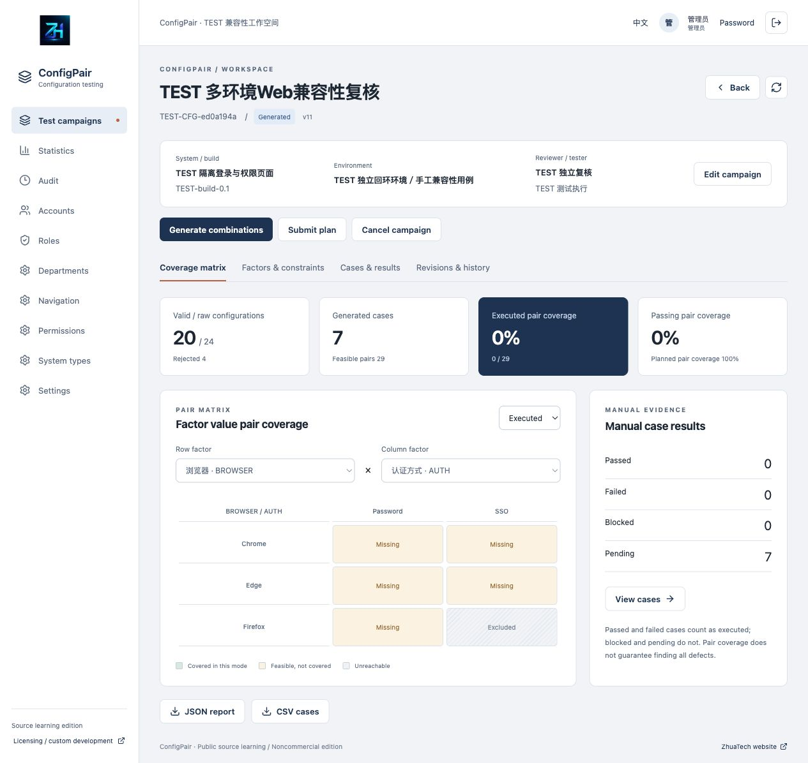<br>**英文界面**：查看英文操作页面。 | 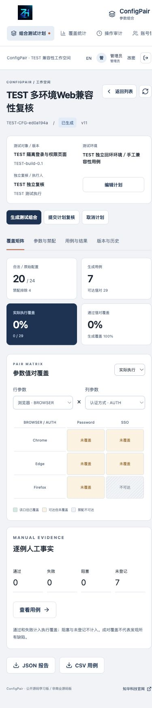<br>**手机界面**：在窄屏布局中查看和操作计划。 |

## 工程与数据

| 部分 | 技术及版本 |
|---|---|
| 后端 | Java21、Maven3.9、Spring Boot4.0.7、Security、JPA、Flyway、MariaDB JDBC3.5.10 |
| 前端 | Node24.19.0、npm11、Vue3.5.40、Vite8.1.5、Lucide1.48.0、ESLint／Prettier |
| 数据库 | MySQL8.4（MySQL8系列），17张身份与业务表及Flyway历史表，共18张 |
| 部署 | Compose包含MySQL、Java服务与Nginx，数据库和后端仅项目内网；前端默认回环8133 |
| 时间 | UTC微秒事实持久化，界面默认Asia/Shanghai |

```text
backend/src/main/java/cn/zhuatech/configpair/ 身份、组合算法、领域事务、接口
backend/src/main/resources/db/migration/    V1身份／V2组合覆盖与结果
backend/src/test/                           真实HTTP/JPA与独立算法测试
frontend/src/                              页面、表单、API、领域函数及测试
frontend/public/brand/                     正式LOGO和原始微信二维码
docs/                                     操作、接口、架构、部署、截图及许可
scripts/                                  随机配置、隔离HTTP验收、发布检查
compose.yaml                              完整本机系统
```

数据库脚本与迁移目录为`backend/src/main/resources/db/migration/`：`V1__identity.sql`、`V2__pair_coverage.sql`。Flyway版本化建表，Hibernate只验证结构。复合外键保证禁配参数与结果版本属于同一计划，编号、参数编码、用例结果与请求键受唯一约束；状态、独立性、覆盖和摘要由事务层复核。

首次空库仅初始化总部、5种角色、8项权限、10个菜单、4种系统类型、3项参数和`admin`，不生成测试计划或结果。

## 安装与运行

需要Docker及Compose2、Python3.11+；联网构建访问官方镜像、Maven Central和npm。镜像构建会运行全部后端测试。

```bash
python3 scripts/init-env.py
docker compose config --quiet
docker compose up --build -d --wait
```

打开 [http://127.0.0.1:8133/](http://127.0.0.1:8133/)，健康检查 [http://127.0.0.1:8133/actuator/health](http://127.0.0.1:8133/actuator/health) 返回`"status":"UP"`。初始化账号`admin`，口令读取本机`.env`中的`ADMIN_PASSWORD`。脚本随机生成三种独立口令，以0600保存并拒绝覆盖；`.env`被Git忽略。修改环境变量不会重置已有库的账号。

先创建真实部门及独立的设计、复核、执行账号，配置相应岗位并归入同一负责部门，再创建业务计划。普通停止用`docker compose down`保留数据卷；仅明确可丢弃的测试库才可清理卷。

| 配置 | 说明 |
|---|---|
| `DATABASE_PASSWORD`／`MYSQL_ROOT_PASSWORD`／`ADMIN_PASSWORD` | 必填，仅本机生成与保存 |
| `WEB_PORT`／`BIND_ADDRESS` | 默认8133／127.0.0.1；端口占用可覆盖WEB_PORT |
| `COOKIE_SECURE` | 本机HTTP false；可信HTTPS对外部署true |
| `DATABASE_URL`／`DATABASE_USER`／`DATABASE_CATALOG` | 后端支持外部连接；通过部署覆盖文件的backend.environment传入，默认Compose不会仅因.env同名配置而注入 |

### 源码开发

准备Java21、Maven3.9及已迁移的本机MySQL，为后端进程设置数据库配置及`ADMIN_PASSWORD`：

```bash
cd backend
mvn spring-boot:run
```

另一个终端在前端目录使用Node24.19.0／npm11：

```bash
cd frontend
npm ci
npm run dev
```

Vite的`/api`及`/actuator`代理到本机8080。宿主不安装Java／Maven时可用官方`maven:3.9-eclipse-temurin-21`。部署覆盖、升级与独立恢复详见[部署与恢复](docs/部署与恢复.md)。

## 验证、升级与故障定位

```bash
cd backend
export TEST_ADMIN_PASSWORD="$(python3 -c 'import secrets; print("Aa9" + secrets.token_urlsafe(24))')"
mvn spotless:check test package
unset TEST_ADMIN_PASSWORD
cd ../frontend
npm ci
npm run format:check
npm run lint
npm test
npm run build
cd ..
docker compose config --quiet
python3 scripts/release-check.py
git diff --check
```

后端43项测试：26项HTTP/JPA业务、权限、撤权、幂等、并发、独立性与历史事实测试；17项算法测试，含80组固定种子模型的独立全枚举覆盖核对和20000配置上限场景。前端15项测试验证参数解析、可达值对索引、覆盖口径、岗位状态、API及CSRF。隔离MySQL验收覆盖7张计划、通过／失败／阻塞、退回、取消、历史、撤权、并发、CSV与独立覆盖复算，共1174项断言。

`TEST_ADMIN_PASSWORD`仅供后端测试使用，临时随机生成，不是运行实例的管理员口令；不要写入源码或使用真实业务账号口令。

```bash
# 仅在明确可丢弃、全新独立回环验收实例执行，会创建TEST账号与业务
python3 scripts/smoke.py --allow-test-writes
python3 scripts/smoke.py --capture
# 重启，或向独立数据库恢复受限备份后
python3 scripts/smoke.py --verify
# 独立恢复实例可使用 TEST_URL=http://127.0.0.1:18133
```

私有`output/qa-state.json`含随机测试口令和对照快照，0600且忽略；日志、备份不发布。升级先备份，在独立测试库核对新迁移；新增Flyway版本，不改已发布SQL，不关闭校验或自动repair。

| 问题 | 处理 |
|---|---|
| 原始配置超限 | 减少候选值或拆分模型；禁配不降低原始上限 |
| 无合法配置 | 检查禁配是否覆盖全部可能，不忽略约束 |
| 候选值不可达 | 核对模型和禁配；不可达值不进入覆盖分母 |
| 修改后当前计划为空 | 重新生成，旧版本仍可在历史查看 |
| 无复核／执行人可选 | 同部门启用账号需有对应权限，不能是当前设计者 |
| 无法提交报告 | 每条用例须明确结果；失败／阻塞须说明；申报需匹配实际阻塞 |
| 版本冲突 | 刷新当前计划后重新打开表单 |
| 初始化口令变更无效 | ADMIN_PASSWORD只用于空库初始化；已有账号走合法改密流程 |
| 启动／迁移失败 | 查看受限本机日志并修复，不跳过测试或清空业务库 |

安全措施包括BCrypt12轮、HttpOnly／SameSite Strict Cookie、CSRF、登录限流、实时权限、数据范围、有限DTO、事务锁、版本与摘要、防SQL拼接及CSV公式注入。对外部署需要可信HTTPS、代理转发头过滤、受限数据库账号、网络访问控制、备份与恢复演练。不要将客户系统配置、实际口令、个人数据或未脱敏证据放进公开仓库。

## 贡献、授权与联系知华科技

本项目由知华科技（上海如静知华信息科技有限公司）提供公开源码学习版本，主要用于个人学习、技术研究与非商业交流。未经书面授权不得商用。企业信息化建设、中小企业数字化转型、中小企业 AI 转型、私有化部署、软件外包、软件项目外包、软件实施、FDE 外包、OPC 技术支持及深度定制开发，请访问知华科技官网 <https://www.zhuatech.cn/>，或添加微信 zhuatech、zhuatech2 咨询。

贡献参阅[CONTRIBUTING](CONTRIBUTING.md)，一般问题使用脱敏Issue；安全漏洞通过[SECURITY](SECURITY.md)的官网或咨询微信私下反馈。第三方说明见[THIRD_PARTY_NOTICES](THIRD_PARTY_NOTICES.md)。本软件用于学习与流程研究，组合覆盖、人工登记和一致性摘要不替代实际测试、领域风险判断或上线审批，不保证发现所有缺陷。

| 咨询微信 zhuatech | 咨询微信 zhuatech2 |
|---|---|
|  |  |

官网：[知华科技](https://www.zhuatech.cn/) · 服务：商业授权、定制开发、部署与系统集成。

商业授权或深度定制开发请联系知华科技。
